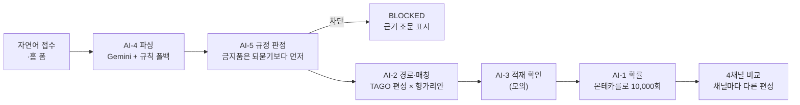
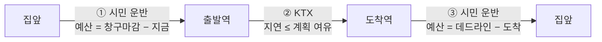
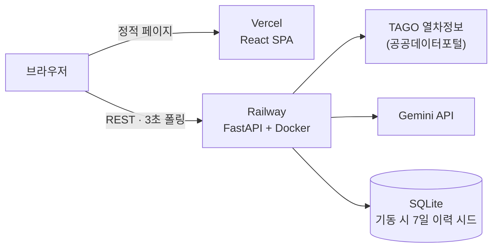

<div align="center">

# KTX 당일배송

**역에 가지 않고 오늘 안에 보내는 3구간 릴레이 특송 — 속도가 아니라 "도착 확률"을 파는 서비스**

MOVE-AI CHALLENGE 2026 · 한국철도공사 트랙 제안 프로토타입입니다.

[](https://move-ai-mu.vercel.app)
[](https://github.com/Patrick-SCH03/move_ai/actions/workflows/ci.yml)

</div>

---

## 왜 만들었나

KTX특송은 이미 빠릅니다. 서울에서 부산까지 3시간이면 화물이 도착합니다.
문제는 하나뿐입니다 — **보내는 사람도 받는 사람도 역까지 가야 한다는 것.**

이 프로젝트는 그 앞뒤를 "배송하러 나가는 사람"이 아니라 **원래 그 길을 가던 시민**에게 얹습니다.

```
집앞 →(시민 운반)→ 출발역 →(KTX 특송)→ 도착역 →(시민 운반)→ 집앞
```

그리고 차별점은 속도가 아니라 **확률**입니다. "오늘 18시까지 97%" — 화면의 세 구간
확률을 곱하면 종합 확률이 소수점까지 그대로 나옵니다. 지어낸 숫자가 아니라
몬테카를로 10,000회의 **계산 결과**라는 뜻이고, 테스트가 매번 그 곱셈을 검증합니다.

---

## 기술 스택

<table>
<tr>
<td align="center" width="33%">

### AI · 엔진


**Gemini 3.6 Flash** (구조화 출력)<br/>
**NumPy** 몬테카를로 10,000회<br/>
헝가리안 알고리즘 (직접 구현)<br/>
**TAGO 공공데이터** (당일 시간표)

</td>
<td align="center" width="33%">

### Back-end


**FastAPI** · **SQLModel**<br/>
**SQLite** · **Docker**<br/>
**Railway** (배포)

</td>
<td align="center" width="33%">

### Front-end


**React 19** · **Vite**<br/>
**Tailwind CSS**<br/>
**Vercel** (배포)

</td>
</tr>
</table>

| 영역 | 선택 | 이유 |
|---|---|---|
| **시간표** | TAGO 공공데이터 당일 수신 | 하드코딩하면 그 순간 낡는다. 포털이 날짜를 하루 밀어 주는 특성까지 응답 날짜 검증으로 흡수 |
| **자연어 접수** | Gemini + 규칙 폴백 | 폴백이 있다는 것은 외부가 느릴 때 포기할 줄 안다는 뜻 — 키가 없어도 같은 흐름이 돈다 |
| **전역 배정** | 헝가리안 직접 구현 | SciPy 함수 하나 때문에 40MB를 넣지 않는다. 무작위 200회 완전탐색 대조 테스트 동반 |
| **실시간성** | 3초 폴링 | WebSocket은 무료 티어에서 연결 유지가 불안정. 폴링으로 충분하고 배포가 단순 |
| **지오코딩** | 내장 지명 사전 | 외부 키 없이도 동작이 같아야 하고, 시연 좌표가 흔들리면 안 된다 |
| **DB** | SQLite | 단일 인스턴스 프로토타입에 별도 DB 서버는 과투자 |

---

## 어떻게 동작하나

접수 문장 하나에 **도구 다섯 개**가 순서대로 붙고, 호출 로그가 화면에 그대로 남습니다.



확률은 구간 사건의 곱으로 정의됩니다. 예산은 비례 배분이 아니라 **운영 규칙에서 역산**합니다.



### 배포 구조



---

## 실제 화면의 계산

> **강남 → 서면 · 오늘 18:00까지 · 노트북 85만원** (기준 시각 12:00)
>
> | 구간 | 담당 | 시각 | 확률 |
> |---|---|---|---|
> | ① 출발지 → 서울역 | 조민재 (러너 · 신뢰도 98%) | 12:00 → 13:58 | 99.0% |
> | ② 서울역 → 부산역 | KTX 39 | 14:28 → 17:12 | 98.3% |
> | ③ 부산역 → 수령지 | 현민채 (프리랜서 · 신뢰도 97%) | 17:16 → 17:33 | 99.0% |
>
> **99.0% × 98.3% × 99.0% = 96.4%** — 화면의 곱셈이 소수점까지 성립합니다.
>
> 비교 화면에서 ①구간 운반자를 김성민(신뢰도 33%)으로 **바꿔 끼우면** 구간·종합
> 확률이 함께 재계산됩니다. 신뢰도가 표시용 점수가 아니라 계산의 입력값이라는 증거입니다.

---

## 주요 기능

| 기능 | 설명 |
|---|---|
| **자연어 접수** | "강남에서 서면으로 노트북 85만원짜리 저녁 6시까지" 한 문장 → 견적. 폼이 기본, 대화는 값이 빠졌을 때만 |
| **4채널 비교** | 창구·무인함·시민 운반·픽업. 채널마다 도착 후 수령 시간이 달라 **탈 수 있는 열차가 다르다** — 각자 최적 편성으로 계산 |
| **확률 곱 불변식** | 구간확률의 곱 = 종합확률 (오차 < 0.002). 상한 99% — 100%는 확률이 아니라 약속으로 읽힌다 |
| **운반자 교체 시연** | 같은 경로에서 사람만 바꾸면 확률이 재계산 — 그 구간의 실제 매칭 후보만 제시 |
| **배차 콜** | 90초 타임아웃, 거절·만료 시 다음 순위. **전부 거절돼도** 구간이 픽업 기사로 전환되어 흐름이 끊기지 않는다 |
| **QR 인계 · 증명** | 구간마다 QR 상호 스캔 + 6자리 코드 병기. 인계마다 증명 이벤트 발행, 외부 조회 API(건당 300원 과금 모델) |
| **지연 대응** | 지연 주입(시연) → 확률 재계산 → 못 맞추면 **도착역 직접 수령 전환**을 대안으로 제시하고 버튼으로 실행 |
| **운반자 보호 장치** | 콜 거절 무불이익(근로자성) · 보증금은 운임에서 적립(예치금 없음) · 안심번호(모의, 인계 후 회수) |
| **운영자 대시보드** | 역별 현황 · 배차 실황 · 남은 편성/적재율 · 배상 재원 · **실측/가정 대장**(가정을 숨기지 않는다) |

---

## 기술적으로 신경 쓴 부분

<details>
<summary><b>1. 불확실성이 확률을 올리던 역전 — σ 벌점 0.30 → 0.15</b></summary>

<br/>

예산이 빠듯한 구간에서 **신뢰도 36% 운반자가 98%보다 확률이 높게** 나왔습니다.
로그정규는 σ가 크면 왼쪽 꼬리도 두꺼워져, '어차피 안 되는 예산'에서는 편차 큰 쪽이
요행으로 이깁니다. 수식은 맞지만 뜻이 틀렸습니다 — 우리 신뢰도의 낮은 값은
'변덕스럽다'가 아니라 **'아직 모른다'**(실적 부족)에서 오므로, 모른다는 사실이
예측을 낙관적으로 만들면 안 됩니다.

→ σ 계수를 0.15로 내려 역전 지점을 목록 하한(5%) 밖으로 밀어냈고, 테스트가
예산 15~90분 구간을 훑으며 이 성질을 지킵니다.

</details>

<details>
<summary><b>2. 늦을수록 좋아지던 화면 — 같은 사건을 두 갈래로 계산한 대가</b></summary>

<br/>

운송 중 확률에서 지연 전 갈래는 라스트마일을 고정 소요로 두고, 지연 후 갈래만
분포로 봤더니 **정상 0.0% · 12분 지연 13.2%** — 늦을수록 좋아지는 화면이 나왔습니다.

→ 두 갈래가 **같은 라스트마일 분포 함수 하나**를 부르게 하고, 지연 전 갈래는
지수분포 지연을 합성합니다. "확정 지연이 미확정보다 높을 수 있다"는 성질은
남는데, 그건 맞습니다 — 확정은 불확실성이 하나 사라진 상태입니다.

</details>

<details>
<summary><b>3. 콜을 전부 거절하면 화면이 영영 '수락 대기' — 전환 함수는 하나</b></summary>

<br/>

후보가 마르면 확률은 대체 경로로 낮게 계산되는데 구간(Leg)은 미수락으로 남아,
울릴 사람도 없고 인계 코드도 열리지 않는 **멈춘 화면인데 정상 동작**인 상태가 됐습니다.

→ `to_fallback()` 하나가 담당을 픽업 기사로 바꾸고 수락 상태·보상 0·전환 사유를
남깁니다. 접수 시점·거절 소진·만료 소진 **세 곳이 같은 함수**를 부르고, 운임은
그대로 둡니다(전환은 이용자의 선택이 아니라 우리 사정). 테스트가 "전부 거절해도
마스터 코드로 3구간 인계가 끝까지 간다"를 검증합니다.

</details>

<details>
<summary><b>4. 채널 마감을 상수로 뒀더니 화면끼리 모순</b></summary>

<br/>

시민 운반 마감을 `출발 −130분` 상수로 두자, 경로 화면은 "96%"라는데 채널 카드는
같은 건을 "접수 마감이 지났어요"라고 했습니다.

→ 마감을 **그 건의 계획에서 역산**합니다(①구간 실소요 + 30분). 상수는 계획이
없을 때의 대표값으로만 남습니다. 선택 불가 카드에도 근거 시각(마지막 편성의
마감·도착)을 채웁니다 — 빈 칸이면 "왜 안 되는가"에 답이 없습니다.

</details>

<details>
<summary><b>5. 헝가리안 무한 루프 — faulthandler 스택 덤프로 특정</b></summary>

<br/>

시드 생성이 매번 같은 지점에서 멈췄습니다. 90초 뒤 스택을 덤프하게 심었더니
`hungarian()` 내부였습니다 — 두 구간의 후보 합집합이 1명뿐이면 2×1 행렬이 되는데,
알고리즘은 행 ≤ 열을 전제해 증강 경로를 영원히 찾고 있었습니다.

→ 함수 안에서 더미 열을 패딩해 전제를 보장하고, 더미에 배정된 행은 미배정으로
돌려줍니다. 회귀 테스트(2×1 행렬)와 완전탐색 200회 대조가 함께 돕니다.
시드 232건 생성이 **10분 초과 → 2.4초**가 됐습니다.

</details>

<details>
<summary><b>6. 공공데이터 포털의 함정 둘 — 날짜 밀림과 DNS 행</b></summary>

<br/>

TAGO는 `depPlandTime=20260813`으로 물으면 **0812 편성**을 줍니다. 응답의
`depplandtime` 앞 8자리를 믿고 원하는 날짜가 나올 때까지 하루씩 밀어 재요청합니다.

또 `urlopen`의 timeout은 **DNS 조회 단계를 덮지 못해서**, 이름 풀이가 막히면
프로세스가 통째로 멈춥니다. 호출을 스레드에 넣고 하드 데드라인을 걸어 어떤
경우에도 회로 차단이 동작하게 했습니다. 실패는 캐시하지 않고, 오류 문구는
한국어로 번역해 `/api/health`까지 올립니다.

</details>

<details>
<summary><b>7. 정시율은 보수 기준 — UIC 15분이면 정보가 사라진다</b></summary>

<br/>

UIC 15분 기준을 쓰면 정시율이 99%대라 화면의 확률이 전부 99%에 붙습니다.
분 단위 데드라인을 파는 서비스에 "15분 늦어도 정시"라는 정의는 무의미합니다.

→ 사업자 공표 5분 기준(KTX 82.69% · SRT 96.48%)을 씁니다. '늦을 확률'(공표
정시율)과 '늦는 크기'(지수분포, 실측 교체 대상)는 **출처가 다른 두 수치**라 섞지
않습니다.

</details>

---

## 프로젝트 구조

```
├── backend/
│   ├── app/
│   │   ├── clock.py          # "HH:MM" ↔ 분 — 시각 파싱은 여기서만
│   │   ├── publicdata.py     # 공공데이터 공통 (회로차단·디스크캐시·스레드 데드라인)
│   │   ├── tago.py           # 오늘 운행 KTX (날짜 밀림 보정·하루 캐시)
│   │   ├── agent.py          # 오케스트레이터 — 도구 호출 순서 + 로그
│   │   ├── orderflow.py      # 접수·배차 콜·대체 전환·인계·알림
│   │   ├── models.py         # Order · Leg · Call · ProofEvent · ProofAccess
│   │   ├── tools/
│   │   │   ├── probability.py   # AI-1 몬테카를로 (곱셈 불변식)
│   │   │   ├── match.py         # AI-2 게이트 + 헝가리안 전역 배정
│   │   │   ├── parse.py         # AI-4 Gemini 구조화 출력 + 규칙 폴백
│   │   │   ├── screen.py        # AI-5 규정·금지품 판정 (실제 조문만)
│   │   │   ├── route.py         # 3구간 경로 조립 (예산은 운영 규칙에서 역산)
│   │   │   └── channels.py      # 4채널 비교 + 배분표 (import 시점 합계 검증)
│   │   ├── seed/             # 요율(공시)·정시율(공표)·취급역 14·운반자 380·약관 전문
│   │   └── routers/          # meta · tools · orders · carrier · ops
│   └── tests/check_all.py    # 성질 검사 — 서버·키 없이 돈다
├── frontend/
│   └── src/
│       ├── screens/          # Home · ChatIntake · ChannelCompare · Progress
│       │                     # History · CarrierApp · OpsView · Legal · My
│       └── components/       # RelayRoute(곱셈 행) · CarrierSwap · PlacePicker …
└── .github/workflows/ci.yml  # 키 없이 도는 검사만 — 키를 기다리는 CI는 빨간 배지만 남는다
```

---

## 시작하기

### 백엔드

```bash
cd backend
python -m venv .venv
.venv\Scripts\pip install -r requirements.txt      # Linux/Mac: .venv/bin/pip
cp .env.example .env                                # 아래 키 입력
.venv\Scripts\python -m uvicorn app.main:app --port 8020 --reload
```

| 환경변수 | 용도 |
|---|---|
| `DATA_GO_KR_KEY` | 공공데이터포털 인증키 — **없으면 시간표를 못 받아 경로가 생성되지 않습니다** |
| `GEMINI_API_KEY` | 자연어 접수 (없어도 규칙 폴백으로 같은 흐름이 돕니다) |
| `DEMO_MODE` | `true`면 마스터 인계 코드 `000000` 허용 (시연용) |
| `DEMO_TIME` | `12:00`처럼 넣으면 기준 시각 고정 — **촬영 후 반드시 비울 것** |
| `SEED_ON_START` | `true`면 기동 시 지난 7일 운영 이력(~230건)을 예측 확률에서 생성 |

### 프론트엔드

```bash
cd frontend
npm install
npm run dev        # /api 는 127.0.0.1:8020 으로 프록시
```

### 테스트 (서버·키 불필요)

```bash
cd backend
.venv\Scripts\python tests/check_all.py    # 성질 검사 — 수치가 아니라 성질을 본다
```

### 배포 전 로컬 확인

```bash
docker build -t timeproof-api backend
docker run --rm -p 8020:8020 --env-file backend/.env timeproof-api
```

---

## API

| 메서드 | 경로 | 설명 |
|---|---|---|
| `GET` | `/api/health` | 상태 + 외부 연동이 **왜 안 되는지** (TAGO 상태·오늘 편수·기준 시각) |
| `POST` | `/api/agent` | 자연어 접수 오케스트레이터 — `tool_calls` 로그 포함 |
| `POST` | `/api/route` | 3구간 경로 (`force_carriers`로 운반자 수동 지정) |
| `POST` | `/api/orders` | 접수 확정 — **동의 없으면 400** (서버가 막는다) |
| `GET` | `/api/orders/{id}/notifications` | 알림 타임라인 + `eta_now` `probability_now` `delay_applies` |
| `POST` | `/api/handover` | 6자리 코드 인계 — 순서 건너뜀·코드 불일치 400 |
| `GET` | `/api/proof/{id}` | 증명 조회 (같은 사업자 24시간 내 중복은 미과금) |
| `GET` | `/api/carrier/{id}/calls` · `/requests` | 운반자 콜(3초 폴링) · 수행 목록 |
| `GET` | `/api/live` · `/api/ops/board` | 홈·운영자 집계 — **전부 실제 주문 행에서** |
| `GET` | `/api/provenance` | 실측/가정 대장 |
| `GET` | `/api/documents` · `/api/terms` · `/api/consents` | 약관 본문·고지 문구·동의 항목 — 서버가 내려준다 |

### 화면

| 주소 | 화면 |
|---|---|
| `/` | 발송인 — 홈 폼 · AI 접수 · 채널 비교 · 진행 |
| `/?view=carrier` | 운반자 — 콜 수신 · 수락 · QR 인계 |
| `/?view=ops` | 운영자 — 역별 현황 · 배차 · 적재 · 실측/가정 대장 |

---

## 시연 세팅

`.env`에 `DEMO_MODE=true` · `DEMO_TIME=12:00` (남은 편성과 빠듯한 여유가 공존하는 시각)

- **신뢰도 대조** — 강남→서면, 데드라인 **17:00**에서 최대로 벌어집니다:
  조민재·현민채 88.2% vs 김성민·김나은 51.2% (**37.0%p**)
- **지연 장면** — 같은 구간 데드라인 **17:50** (여유 17분):
  탑재 94.3% → 12분 지연 77.5% (흡수) → **25분 지연 0%** (붕괴) → 역 수령 전환 **94.6%** (회복)
- 인계는 마스터 코드 `000000` (DEMO_MODE에서만 열립니다)
- **촬영이 끝나면 `DEMO_TIME`을 반드시 비웁니다** — 화면에 고정 표시가 없어, 켜 둔 채 잊으면 마감 시각이 조용히 틀립니다

---

## 데이터 출처와 한계

| 출처 | 쓰는 곳 | 한계 |
|---|---|---|
| **국토교통부 TAGO 열차정보** | 오늘 운행 편성·시각 — 시간표를 하드코딩하지 않고 당일 수신 | 운행 '계획'입니다. 실시간 위치가 아닙니다 |
| **사업자 공표 정시운행률** (KTX 82.69% · SRT 96.48%, 5분 기준) | 열차가 늦을 **확률** | 연간·반기 평균입니다 |
| **KTX특송 공시 요율** | 기본 운임 6등급 · 무게/거리/가액 할증 · 수탁 한도 | 채널 추가 운임(+1,000~+7,000)은 우리 **제안값**입니다 |

**하는 척하지 않은 것** — 본인확인(PASS)·안심번호 발급은 계약이 필요한 영역이라
형식만 남기고 화면에 **'모의'라고 밝혔습니다**. 실시간 열차 지연도 공공데이터가
어제까지만 제공하므로 시연에서는 수동 주입이며, 화면에 "실제 운영에서는 관제
연동"이라고 적었습니다. 전체 가정 목록은 운영자 화면의 **실측/가정 대장**에 있습니다.

---

## 주의

- 본 프로토타입은 **공식 서비스가 아니며**, 운임 일부와 표시 수치 일부는 가정치입니다.
- 운영 이력(지난 7일 주문·정시율)은 **시연용 가상 데이터**로, 예측 확률에서 결과를 생성한 것입니다.
- KORAIL CI·로고는 제안 목적으로만 사용했습니다.
